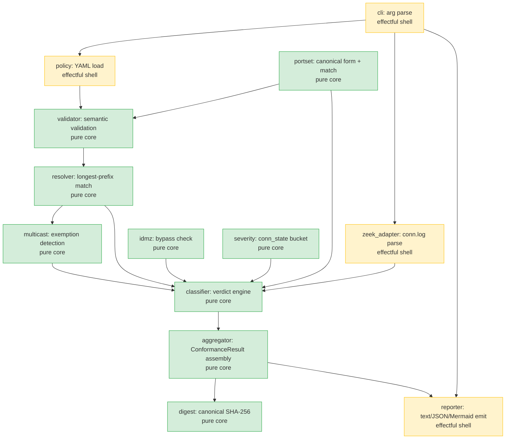

# SS-00: System Overview & Principles

## Product Statement

zonewarden is a **pure function of its file inputs**: given a YAML segmentation policy and
a captured flow log it deterministically classifies every flow and emits a violations report
and a Mermaid topology diagram. It is a single offline Rust binary with no network access
and no side effects on its input files.

## Architectural Mandate: The Iron Law

Every module is classified as **pure core** or **effectful shell**. No exceptions.

- **Pure core:** deterministic, side-effect-free Rust functions. Takes data in, returns
  data out. No I/O, no network, no global state. These are the **Kani proof targets**.
- **Effectful shell:** file I/O, argument parsing, output writing. Tested via integration
  tests and proptest; NOT Kani-provable by construction.

The purity boundary is enforced **at the Cargo crate boundary** (ADR-002):
- `zonewarden-core` — pure library crate; the Kani harness crate depends on this.
- `zonewarden` (binary crate) — thin I/O shell; depends on `zonewarden-core`.

No `std::fs`, `std::net`, or `std::env` in `zonewarden-core`. Enforced via `#![no_std]`
where feasible and by CI audit.

## Key Architectural Constraints

| Constraint | Source | Implementation Mechanism |
|-----------|--------|------------------------|
| Offline — zero network I/O | DI-012 | No `std::net` in `core`; `cargo deny` to audit deps |
| Read-only inputs | DI-012 | Files opened `O_RDONLY`; no write syscall on input paths |
| Deterministic output | DI-009 | Total-order sort before output; no HashMap iteration in output path |
| Deny-by-default | DI-001 | Default arm in classifier returns `NoMatchingConduit` |
| Fail-fast on bad policy | DI-011 | Pipeline exits before flow ingest if policy validation fails |
| Streaming ingest | FM-007/OQ-003 | Flows processed as iterator; only violations (not all verdicts) retained |
| u64 tallies, checked arithmetic | FM-009 | `checked_add` on all tally increments; abort on overflow |

## Component Diagram

## Module Dependency Direction (Acyclic)

Build order (topological): `portset → policy → validator → resolver → multicast → idmz
→ severity → classifier → zeek_adapter → aggregator → digest → reporter → cli`

No module depends on one later in this order. The graph is strictly acyclic (verified
by inspection; CI enforces via `cargo check --workspace`).

## Pipeline Stages (ST-1..ST-8)

| Stage | Module(s) | Pure? | Description |
|-------|-----------|-------|-------------|
| ST-1 Load policy | `policy` | Effectful | File read, YAML parse |
| ST-2 Validate policy | `validator`, `portset` | **Pure** | Semantic checks; build resolver index |
| ST-3 Ingest flows | `zeek_adapter` | Effectful | Stream conn.log lines into `Flow` iterator |
| ST-4 Normalize | `zeek_adapter` | Effectful | Service inference, IPv4-mapped canonicalization |
| ST-5 Resolve endpoints | `resolver`, `multicast` | **Pure** | Longest-prefix match; multicast detection |
| ST-6 Classify | `classifier`, `idmz`, `severity` | **Pure** | Verdict + IDMZ check per flow |
| ST-7 Aggregate | `aggregator`, `digest` | **Pure** | ConformanceResult; tallies; digest |
| ST-8 Render | `reporter` | Effectful | text/JSON/Mermaid; atomic write |
