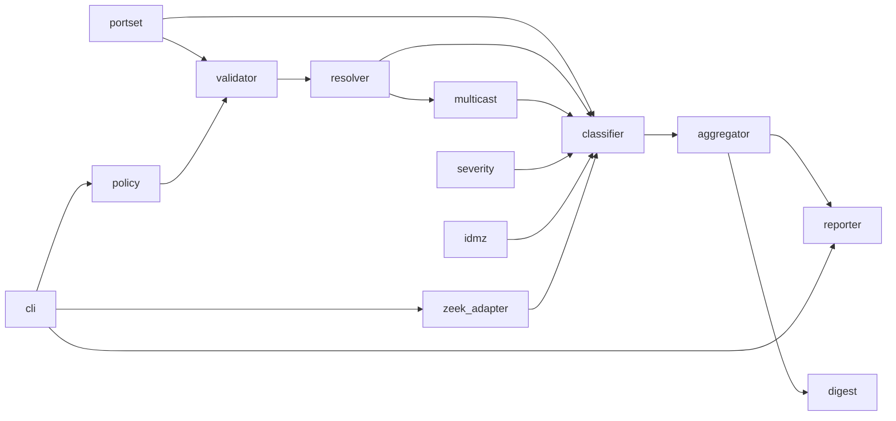

# Module Criticality Classification: zonewarden

## Tier Definitions

| Tier | Mutation Kill Rate Target | Description |
|------|--------------------------|-------------|
| **CRITICAL** | ≥ 95% | Modules that decide security verdicts; errors are directly exploitable (silent-allow or missed-idmz-bypass) |
| **HIGH** | ≥ 90% | Modules with significant correctness impact; errors reduce data fidelity or produce wrong counts |
| **MEDIUM** | ≥ 80% | Supporting modules; errors degrade output quality but do not affect security verdicts |
| **LOW** | ≥ 70% | Infrastructure, glue code; errors are cosmetic |

## Module Inventory

- **policy** — YAML load, serde deserialization, duplicate-key detection, token validation
- **validator** — Policy semantic validation: zone uniqueness, conduit endpoints, tie detection, /0 rejection
- **portset** — PortSet normalization (canonical form, DI-020), matching
- **resolver** — Longest-prefix zone resolution index, EXTERNAL fallback, IPv4-mapped canonicalization
- **multicast** — Step-1/Step-2 multicast/broadcast detection
- **classifier** — ST-6 verdict evaluation: IntraZone, conduit matching (any-match union), WrongDirection, NoMatchingConduit
- **idmz** — IDMZ no-bypass rule (DI-006 truth table)
- **severity** — conn_state → Severity bucket mapping (DI-017)
- **aggregator** — ConformanceResult assembly, tallying, DI-015 identity, ordering (DI-009)
- **digest** — Canonical JSON serialization + SHA-256 for policy digest (DI-018)
- **zeek_adapter** — Zeek conn.log TSV parser, Flow normalization, service inference
- **reporter** — Text/JSON/Mermaid output formatters, exit code logic, atomic write
- **cli** — Argument parsing, flag validation, main entry point

## Module Classification

| Module | Path (anticipated) | Tier | Rationale | Kill Rate Target | Key BCs |
|--------|-------------------|------|-----------|-----------------|---------|
| classifier | `src/classifier.rs` | CRITICAL | Decides every security verdict; errors produce silent-allows or missed violations (DI-001, DI-002) | ≥ 95% | BC-1.04.001 through BC-1.04.011 |
| resolver | `src/resolver.rs` | CRITICAL | Zone resolution underpins every verdict; wrong resolution = wrong verdict (DI-003, DI-004) | ≥ 95% | BC-1.03.001 through BC-1.03.005 |
| idmz | `src/idmz.rs` | CRITICAL | IDMZ bypass detection; errors miss the headline security check (DI-006) | ≥ 95% | BC-1.04.007, BC-1.04.008 |
| validator | `src/validator.rs` | CRITICAL | Policy validation; bugs allow malformed policies to run, corrupting all verdicts (DI-010, DI-011) | ≥ 95% | BC-1.01.004 through BC-1.01.007 |
| portset | `src/portset.rs` | CRITICAL | PortSet matching and canonical form; wrong matching = wrong allow/deny (DI-020) | ≥ 95% | BC-1.01.009, BC-1.04.006 |
| aggregator | `src/aggregator.rs` | HIGH | Tally errors produce wrong counts; u64 overflow is an abort path (DI-015, FM-009) | ≥ 90% | BC-1.05.001 through BC-1.05.005 |
| zeek_adapter | `src/adapters/zeek.rs` | HIGH | Parser errors silently skip flows (degraded data); unspecified-address handling is security-adjacent (DI-013) | ≥ 90% | BC-1.02.001 through BC-1.02.006 |
| multicast | `src/multicast.rs` | HIGH | Multicast detection errors cause false-positive NoMatchingConduit violations at scale (DI-016) | ≥ 90% | BC-1.03.003, BC-1.03.004 |
| policy | `src/policy.rs` | HIGH | Load/parse errors abort correctly (DI-011); dup-key detection is a security property (DI-010) | ≥ 90% | BC-1.01.001 through BC-1.01.003 |
| severity | `src/severity.rs` | HIGH | Incorrect severity degrades violation report quality; conservative default is a safety property (DI-017) | ≥ 90% | BC-1.04.009 |
| digest | `src/digest.rs` | HIGH | Wrong digest undermines the evidence-chain trust model (DI-018) | ≥ 90% | BC-1.05.003 |
| reporter | `src/reporter.rs` | MEDIUM | Formatting errors degrade output readability; do not affect verdict correctness | ≥ 80% | BC-1.06.002 through BC-1.06.008 |
| cli | `src/main.rs` + `src/cli.rs` | MEDIUM | Arg parse errors produce wrong exit codes; mitigated by integration tests | ≥ 80% | BC-1.06.001, BC-1.06.006 |

## Per-Module Risk Assessment

| Module | Tier | Blast Radius | Security Sensitivity | Implementation Complexity |
|--------|------|-------------|---------------------|--------------------------|
| classifier | CRITICAL | High | High | Medium |
| resolver | CRITICAL | High | High | High (longest-prefix with tie-free guarantee) |
| idmz | CRITICAL | Medium | High | Medium (truth table enumeration) |
| validator | CRITICAL | High | High | Medium |
| portset | CRITICAL | High | High | High (canonical form + matching edge cases) |
| aggregator | HIGH | Medium | Low | Medium (accounting identity + overflow) |
| zeek_adapter | HIGH | Medium | Medium (unspecified address) | Medium |
| multicast | HIGH | Medium | Medium | Low |
| policy | HIGH | High | Medium | Medium |
| severity | HIGH | Low | Low | Low |
| digest | HIGH | Medium | Medium | High (exact canonicalization) |
| reporter | MEDIUM | Low | None | Low |
| cli | MEDIUM | Low | Low | Low |

## Classification Summary

| Tier | Module Count | Percentage |
|------|-------------|------------|
| CRITICAL | 5 | 38% |
| HIGH | 6 | 46% |
| MEDIUM | 2 | 15% |
| LOW | 0 | 0% |
| **Total** | **13** | **100%** |

## Dependency Graph — Build Order

## Implementation Priority Order

1. **portset** — PortSet type and canonical form; everything downstream depends on matching
2. **policy** — Policy model types; required by all other modules
3. **validator** — Policy validation; gate before any pipeline work
4. **resolver** — Zone resolution index; Kani proof target
5. **multicast** — Multicast detection; required before classifier
6. **idmz** — IDMZ truth table; Kani proof target
7. **severity** — Simple conn_state bucket lookup
8. **classifier** — Core verdict engine; Kani proof target
9. **zeek_adapter** — First RealitySource; fuzz target
10. **aggregator** — ConformanceResult assembly; accounting identity Kani proof
11. **digest** — SHA-256 policy digest; Kani proof target
12. **reporter** — Output formatters
13. **cli** — Argument parsing and integration

## Cross-Cutting Concerns by Tier

| Concern | CRITICAL modules | HIGH modules | MEDIUM/LOW modules |
|---------|-----------------|-------------|-------------------|
| Error handling | `Result<T, E>` with typed error enum; no `.unwrap()` except in tests | `Result<T, E>` throughout | `Result<T, E>` in hot paths; `.expect()` acceptable in arg parsing |
| Arithmetic | `checked_add` for all tally increments | `checked_add` for counters | Standard arithmetic |
| I/O | None (pure functions) | Stream/iterator for adapters | `fs::write` with temp+rename for output |
| Logging | No log macros in CRITICAL; pure return values | Warnings returned as `Vec<String>` | `eprintln!` or structured for diagnostics |
